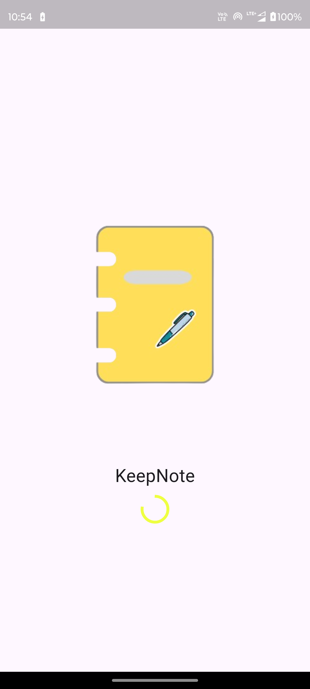
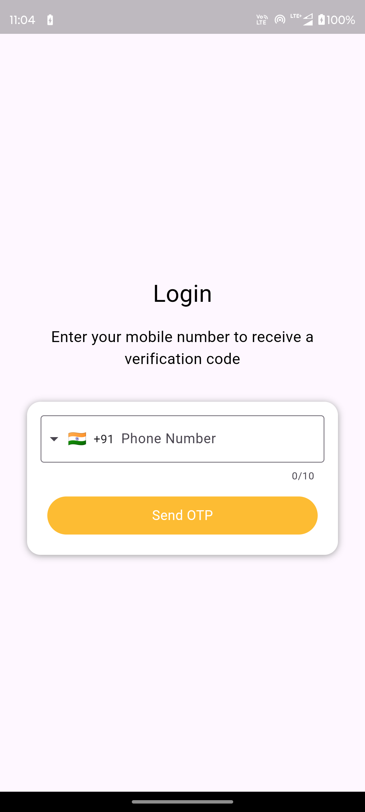
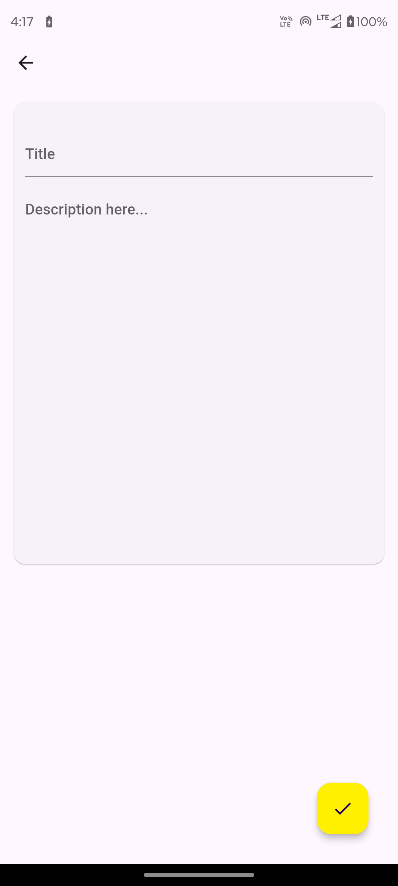
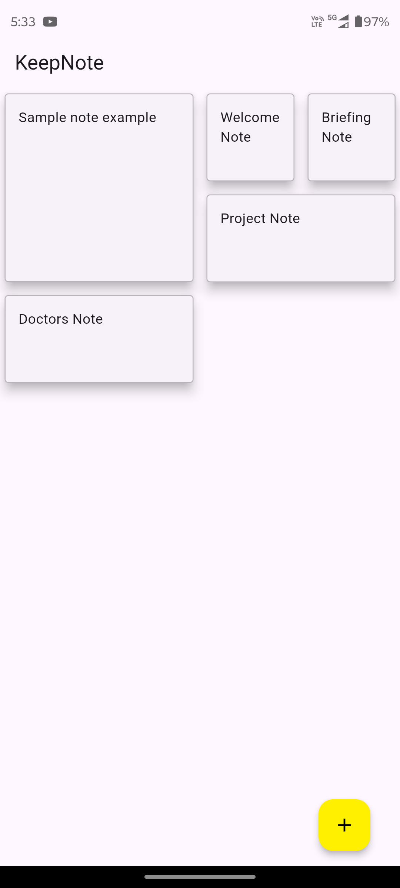
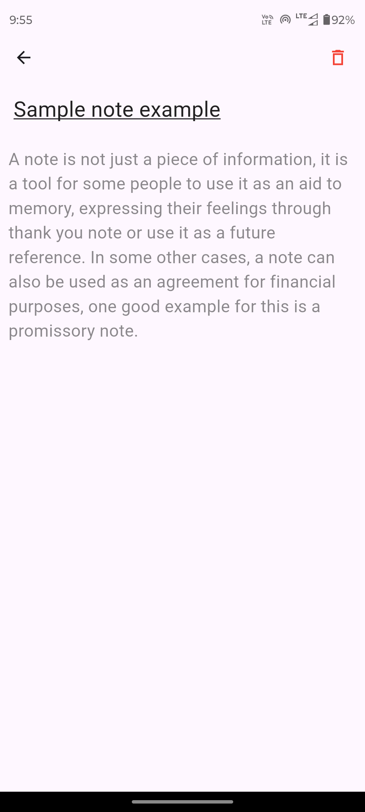

# KeepNote

A Flutter project for making simple notes.

<h3>Overview</h3>

This is a simple note making app made in flutter.  The below are the features of the app. 
Login with phone number using firebase.
Upload, Delete data to the server.

<b>Note: </b>Connect the app to your firebase account and ensure that phone auth is turned ON. 
             Replace the variables of <a href="lib/screens/detail/site_url.dart">site_url.dart</a> file to your server URLs.
             
<h4>Screenshots</h4>  

Screenshot 1               |  Screenshot 2             |  Screenshot 3
:-------------------------:|:-------------------------:|:-------------------------:
  |   | 

 

Screenshot 4               |  Screenshot 5             |  Screenshot 6
:-------------------------:|:-------------------------:|:-------------------------:
  |   | 

